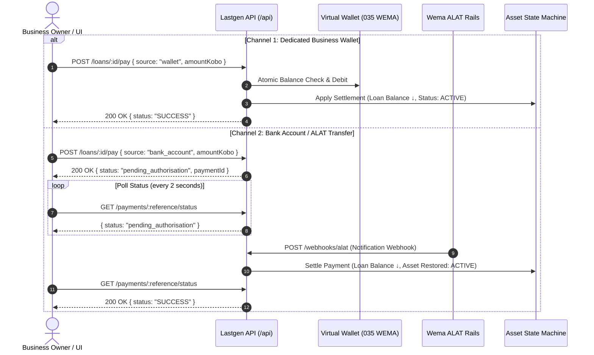

# Lastgen Frontend ↔ Backend Integration Guide

> **Wema Hackaholics 7.0 · Hackathon Track · Team Ryzen**  
> **Backend Architecture & Linking Guide for Frontend Engineering**  
> **Single Source of Truth:** `docs/CONTRACT.md` + `docs/PAYMENT_EXTENSION.md`

---

## 1. Quickstart & Dev Server

### Step 1: Install & Boot Backend
```bash
cd backend
cp .env.example .env        # Default demo values work out of the box
pnpm install
pnpm dev                    # Running on http://localhost:8080
```

Verify backend health:
```bash
curl http://localhost:8080/health
# Response: {"ok":true}
```

### Step 2: Switch Frontend from Mock to Live Backend
In `frontend/.env` (or `frontend/.env.local`):
```dotenv
VITE_API_MODE=live
VITE_API_URL=http://localhost:8080
```
- When `VITE_API_MODE=live`, `frontend/src/lib/api.ts` routes all HTTP requests to `http://localhost:8080/api`.
- In demo mode (`DEMO_MODE=true` on backend), authentication is skipped, allowing immediate UI exploration.

---

## 2. API Contract & Response Envelope

Every endpoint wraps its payload in the frozen contract envelope:

### Success Envelope
```json
{
  "ok": true,
  "data": { ... }
}
```

### Error Envelope
```json
{
  "ok": false,
  "error": {
    "code": "QUOTE_NOT_VIABLE",
    "message": "This system costs more per month than current fuel spend."
  }
}
```

### Standard Error Codes for UI Handling
| Error Code | HTTP Status | Meaning / Recommended UI Action |
| :--- | :---: | :--- |
| `NOT_FOUND` | 404 | Resource does not exist (display 404 card or redirect) |
| `VALIDATION` | 400 | Invalid form fields (display inline input validation message) |
| `QUOTE_NOT_VIABLE` | 422 | Lease costs more than fuel spend (prompt longer tenor/smaller system) |
| `MEDICAL_FLAG` | 409 | Suspension forbidden for life-safety medical load (show alert banner) |
| `PAYMENT_REQUIRED`| 402 | Wallet balance insufficient for repayment (prompt wallet top-up) |
| `INVALID_TRANSITION`| 409 | Action not permitted for current state (e.g. approving already approved file) |
| `UNAUTHORIZED` | 401 | Missing/expired bearer token in live production mode |

---

## 3. Screen-by-Screen Frontend Linking Specification

### 1. Burn View (`frontend/src/routes/owner/Burn.tsx`)
- **Primary Data:**
  - `api.businesses.get('biz_adaeze_frozen')` → Business details (`generatorKva`, `hoursPerDay`, `medicalFlag`).
  - `api.businesses.burn('biz_adaeze_frozen')` → Burn profile:
    - `data.litresPerDay` (e.g. 15.5)
    - `data.dailyKobo` (e.g. 1,614,994 kobo = ₦16,149.94)
    - `data.monthlyKobo` (e.g. 48,449,820 kobo = ₦484,498.20)
    - `data.annualKobo` (e.g. 589,472,810 kobo = ₦5,894,728.10)
    - `data.verified` (`true` when observed history ≥ 14 days)
- **Live Counter Rate:**
  - `ratePerSecondKobo = Math.round(burn.dailyKobo / 86400)` (e.g., 187 kobo/sec).
- **Actions:**
  - **Manual Log:** `POST /api/businesses/:id/fuel-logs` with `{ litres, amountKobo, pricePerLitreKobo, loggedAt }`.
  - **Receipt Upload:** `POST /api/businesses/:id/receipts` (FormData with `file`) → returns extracted log via Gemini Vision.

---

### 2. Quote View (`frontend/src/routes/owner/Quote.tsx`)
- **Primary Data:**
  - `api.quotes.get('q_biz_adaeze_frozen')` → Sized solar system quote:
    - `data.system` (`name`, `panelW`, `batteryKwh`, `inverterKva`, `priceKobo`)
    - `data.depositKobo` (e.g. ₦742,000)
    - `data.monthlyPaymentKobo` (e.g. ₦366,545.39)
    - `data.monthlySavingsKobo` (e.g. ₦117,952.81)
    - `data.savingsPct` (e.g. 24.3%)
    - `data.breakEvenMonth` (e.g. Month 7)
- **Amortisation Schedule:**
  - `api.loans.schedule('loan_biz_adaeze_frozen')` → Array of `{ n, dueAt, principalKobo, interestKobo, balanceKobo }`.

---

### 3. Asset & PAYG Telemetry View (`frontend/src/routes/owner/Asset.tsx`)
- **Primary Data:**
  - `api.assets.get('ast_biz_adaeze_frozen')` → Current state (`ACTIVE`, `GRACE`, `SUSPENDED`, `OWNED`), serial number, controller ID.
  - `api.loans.get('loan_biz_adaeze_frozen')` → Remaining balance (`balanceKobo`), next due date (`nextDueAt`).
- **IoT Meter Feed:**
  - `api.assets.meter('ast_biz_adaeze_frozen')` → 90-day time-series readings:
    - `whGenerated`: Daily solar daylight curve.
    - `whConsumed`: Actual shop electricity draw.
    - `batterySocPct`: Battery state-of-charge percentage.
    - *Note:* During `SUSPENDED` status, power delivery is hardware-clamped to `40W` (preserved baseline lighting).

---

### 4. Wrapped Annual Review (`frontend/src/routes/owner/Wrapped.tsx`)
- **Primary Data:**
  - `api.businesses.wrapped('biz_adaeze_frozen', 2026)` → Spotify-Wrapped payload:
    - `nairaSavedKobo`: Total naira saved vs fuel (e.g. ₦5,796,000).
    - `litresNotBurned`: Displaced fuel in litres (e.g. 5,037 L).
    - `co2KgAvoided`: Avoided carbon in kg (e.g. 11,635 kg @ 2.31 kg CO₂/L).
    - `monthsToOwnership`: Remaining term before full asset ownership.
    - `bestMonth`: Peak solar generation month (e.g. "March").
    - `rank`: City leaderboard position (e.g. #12 in Lagos).

---

### 5. Credit Desk Applications (`frontend/src/routes/bank/Applications.tsx`)
- **Primary Data:**
  - `api.credit.applications({ status: 'PENDING' })` → List of pending credit files.
  - Supports tab filtering by status: `PENDING`, `APPROVED`, `DECLINED`.
  - Table columns: Business name, City, Monthly burn, Monthly instalment, Affordability ratio, Status pill.

---

### 6. Credit File Underwriting (`frontend/src/routes/bank/CreditFile.tsx`)
- **Primary Data:**
  - `api.credit.application('cf_biz_bilikisu_tailor')` → Detailed underwriting projection:
    - Proposal: `monthlyPaymentKobo` vs verified `monthlyBurnKobo`.
    - Risk Metrics: `affordabilityRatio` (e.g. 0.92), `loadProfileScore` (e.g. 74), `verifiedMonths` (e.g. 3).
    - Verification Evidence: Attached `fuelLogs` array (last 24 logs).
    - Schedule Preview: First 6 months amortisation.
- **Actions:**
  - **Approve:** `POST /api/credit/applications/:id/approve` → Simultaneously activates `Loan` and provisions `Asset` (status `ACTIVE`).
  - **Decline:** `POST /api/credit/applications/:id/decline` with `{ reason: "Fuel history too short" }`.

---

### 7. Portfolio & Securitisation Desk (`frontend/src/routes/bank/Portfolio.tsx`)
- **Primary Data:**
  - `api.portfolio.stats()` → Aggregate KPIs across 523 financed assets:
    - `portfolioValueKobo`: Total book value in kobo.
    - `repaymentRatePct`: e.g. 92.4%.
    - `parPct`: Portfolio at Risk (PAR) e.g. 7.6%.
    - `suspendedCount`: Assets currently suspended.
    - `litresDisplaced`: Cumulative litres of fuel displaced.
    - `co2TonnesAvoided`: Cumulative tonnes of CO₂ avoided.
    - `byCity`: Distribution array `[{ city: "Lagos", count: 215 }, ...]`.
- **Paged Asset Ledger:**
  - `api.portfolio.assets({ page: 1, city: 'Lagos', status: 'ACTIVE' })` → 25 assets per page.
- **Securitisation Export:**
  - `api.portfolio.exportCsv()` → Generates securitisation CSV export URL and timestamp.

---

### 8. Demo Control Center (`frontend/src/routes/demo/DemoControl.tsx`)
- **Actions:**
  - **Reset Seed:** `POST /api/demo/reset` → Resets all data to the pristine seed.
  - **Advance Clock:** `POST /api/demo/advance-time` with `{ days: 30 }` → Advances system time and executes automated arrears & grace sweeps.
  - **Simulate Default:** `POST /api/demo/miss-payment` with `{ loanId: "loan_biz_adaeze_frozen" }` → Forces loan to `DELINQUENT` and asset to `GRACE` / `SUSPENDED`.

---

## 4. Payment & Wallet Flow (Two Channels)



### Virtual Account Setup
- `POST /api/wallets/create` with `{ businessId, nin, firstName, lastName, phone }`
- Returns: `{ id, accountNumber: "2010000001", bankCode: "035", balanceKobo: 5000000 }` (pre-funded in demo mode with NGN 50,000).

---

## 5. Seeded Deep-Link Identifiers

Use these deterministic constants in demo routes and initial page loads:

| Resource | Identifier |
| :--- | :--- |
| **Demo Business (Default)** | `biz_adaeze_frozen` (Adaeze Frozen Foods, Lagos) |
| **Medical Flagged Business** | `biz_gwarinpa_mart` (Gwarinpa Value Mart, Abuja — Medical Flag `true`) |
| **Pending Credit Files** | `cf_biz_bilikisu_tailor`, `cf_biz_kelechi_cuts`, `cf_biz_ogunlade_welding` |
| **Demo Loan** | `loan_biz_adaeze_frozen` |
| **Demo Asset** | `ast_biz_adaeze_frozen` |
| **Demo Quote** | `q_biz_adaeze_frozen` |

---

## 6. Verification & Test Checklist

Before demo or deployment, verify:
- [x] Backend passes all 166 contract, correctness, and E2E tests (`pnpm test`).
- [x] Medical-flag invariant: `POST /api/assets/ast_biz_gwarinpa_mart/suspend` returns `409 MEDICAL_FLAG`.
- [x] Zero-float money arithmetic: integer kobo throughout.
- [x] ALAT webhook is replay-safe and idempotent on `transactionReference`.
- [x] Frontend runs seamlessly in live mode against `http://localhost:8080` or Render URL.