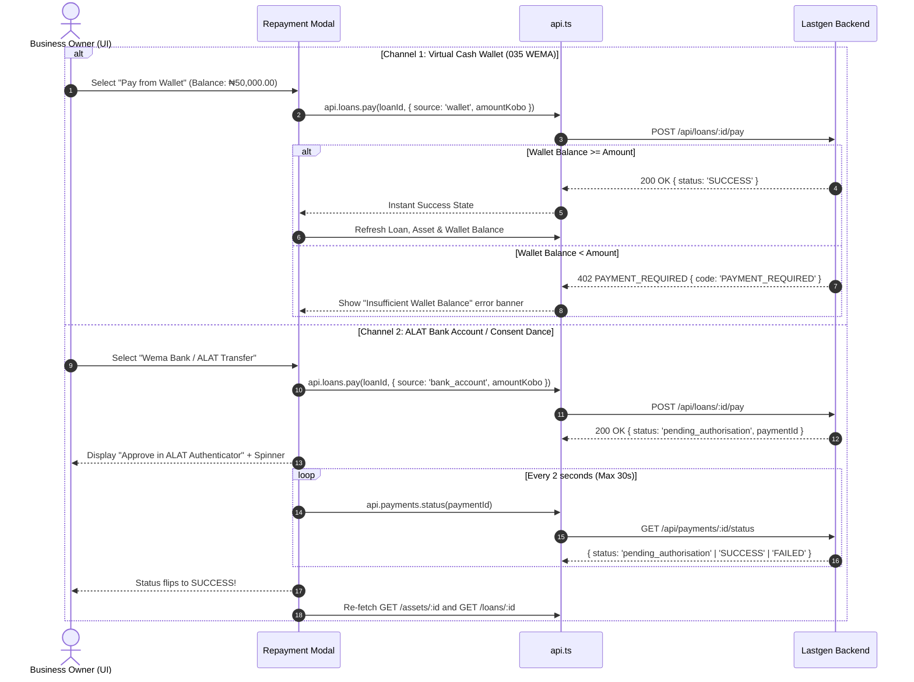

# Lastgen: Frontend ↔ Backend Integration Masterplan & AI Prompting Playbook

> **Wema Hackaholics 7.0 · Hackathon Track · Team Ryzen**  
> **Author:** Lead Backend Engineer  
> **Audience:** Frontend Engineers & AI Coding Agents (Cursor / Windsurf / Antigravity / Claude Code)  
> **Source Documents:** [`docs/CONTRACT.md`](file:///C:/Users/Jerry%20Koko/Desktop/lastgen/docs/CONTRACT.md), [`docs/PAYMENT_EXTENSION.md`](file:///C:/Users/Jerry%20Koko/Desktop/lastgen/docs/PAYMENT_EXTENSION.md), [`GUIDE.md`](file:///C:/Users/Jerry%20Koko/Desktop/lastgen/GUIDE.md)

---

## 1. Executive Summary & Review

The Lastgen backend on `feat/backend` has reached **100% production readiness** with a fully typed, deterministic domain engine suite, Wema ALAT payment rails, virtual business wallets (035 Wema code), atomic Supabase migrations, and automated telemetry simulation.

Currently, the frontend routes in `frontend/src/routes/` render beautifully styled UI components but are powered by **static hardcoded constants and mock placeholders**. This masterplan bridges every backend endpoint, state machine invariant, and lifecycle flow into the frontend.

### Summary of Major Backend Upgrades

| Domain / Feature | Backend Implementation (`feat/backend`) | Current Frontend State | Required Action |
| :--- | :--- | :--- | :--- |
| **API Client & Mode** | Express at `http://localhost:8080/api` with strict envelope `{ ok, data, error }`. | `frontend/src/lib/api.ts` handles envelopes but lacks new endpoints. | Add wallet, payment status, and typed routes to `api.ts`. |
| **Business Cash Wallets** | Virtual 035 Wema accounts (`POST /wallets/create`, `GET /wallets/balance`, `GET /wallets/statement`). Demo mode auto-funds **₦50,000.00** (5,000,000 kobo). | No wallet UI or API methods. | Create Wallet Card & Statement components in Owner view. |
| **Two-Channel Payments** | `POST /loans/:id/pay` takes `{ source: 'wallet' \| 'bank_account', amountKobo? }` and returns slim `{ paymentId, platformTransactionReference, status }`. | Mock `PayResult` expected full `{ payment, loan, asset }`. | Update `PayBody`/`PayResult` types; build Payment Modal with ALAT 2s polling & Wallet instant debit. |
| **Payment Status & Polling** | `GET /payments/:reference/status` accepts payment ID or reference; reconciles with ALAT. | Absent in frontend client. | Implement 2-second polling hook for `pending_authorisation` payments. |
| **Fuel Burn & OCR** | `GET /businesses/:id/burn`, `POST /fuel-logs`, `POST /receipts` with Gemini Vision OCR fallback. | `Burn.tsx` has static numbers & dead capture buttons. | Wire live burn counter, manual fuel logging dialog, and file upload receipt scanner. |
| **Credit Underwriting** | `GET /credit/applications`, `POST /approve`, `POST /decline`. | `Applications.tsx` and `CreditFile.tsx` use static arrays. | Connect live triage queue, tab filtering, and instant approve/decline mutations. |
| **Asset PAYG & Medical Guard** | Telemetry simulator (`GET /assets/:id/meter`). Medical facilities (`medicalFlag: true`) are **strictly un-suspendable**. | `Asset.tsx` uses static numbers and placeholders. | Wire 90-day meter chart, real asset status pills, and medical safety warning banner. |
| **Portfolio & Securitisation** | `GET /portfolio/stats`, `GET /portfolio/assets`, `POST /portfolio/export`. | `Portfolio.tsx` has static stats and disabled Export button. | Wire real metrics, paginated ledger, and CSV export trigger. |
| **Demo Control Center** | `POST /demo/reset`, `POST /demo/advance-time`, `POST /demo/miss-payment`. | `DemoControl.tsx` buttons are unlinked. | Connect Zustand demo store to live backend demo endpoints. |

---

## 2. Type System & API Client Updates

### 2.1. Update `frontend/src/types/api.ts`

Replace the outdated sections of [`frontend/src/types/api.ts`](file:///C:/Users/Jerry%20Koko/Desktop/lastgen/frontend/src/types/api.ts) with the following additions:

```typescript
// Payment & Wallet Extension Types
export type PaymentSource = 'ALAT' | 'SIMULATED' | 'WALLET';

export type PaymentStatus =
  | 'pending_authorisation'
  | 'authorised'
  | 'SUCCESS'
  | 'FAILED'
  | 'EXPIRED';

export interface Payment {
  id: string;
  loanId: string;
  amountKobo: number;
  paidAt: string;
  source: PaymentSource;
  reference: string;
  status: PaymentStatus;
  platformTransactionReference?: string | null;
}

export interface Wallet {
  id: string;
  businessId: string;
  accountNumber: string;
  bankCode: string;
  balanceKobo: number;
  currency: string;
  createdAt: string;
}

export type WalletDirection = 'IN' | 'OUT';

export interface WalletTransaction {
  id: string;
  walletId: string;
  ts: string;
  direction: WalletDirection;
  amountKobo: number;
  description: string;
  reference: string;
  category: string;
}

export interface CreateWalletBody {
  businessId: string;
  nin: string;
  firstName: string;
  lastName: string;
  phone: string;
}

export interface PayBody {
  source: 'wallet' | 'bank_account';
  amountKobo?: number;
}

export interface PayResult {
  paymentId: string;
  platformTransactionReference: string | null;
  status: PaymentStatus;
}

export interface PaymentStatusResult {
  status: PaymentStatus;
  payment?: Payment;
}

export interface WalletStatementQuery {
  limit?: number;
  before?: string;
}
```

### 2.2. Update `frontend/src/lib/api.ts`

Add wallet, payment status, and updated loan pay methods to [`frontend/src/lib/api.ts`](file:///C:/Users/Jerry%20Koko/Desktop/lastgen/frontend/src/lib/api.ts):

```typescript
export const api = {
  mode: API_MODE,

  businesses: {
    create: (body: CreateBusinessBody) => post<Business>('/businesses', body),
    get: (id: string) => request<Business>(`/businesses/${id}`),
    uploadReceipt: (id: string, file: File) => {
      const form = new FormData();
      form.append('file', file);
      return request<FuelLog>(`/businesses/${id}/receipts`, { method: 'POST', body: form });
    },
    addFuelLog: (id: string, body: CreateFuelLogBody) =>
      post<FuelLog>(`/businesses/${id}/fuel-logs`, body),
    burn: (id: string) => request<BurnProfile>(`/businesses/${id}/burn`),
    impact: (id: string, period: ImpactPeriod = 'month') =>
      request<ImpactSummary>(`/businesses/${id}/impact`, { query: { period } }),
    wrapped: (id: string, year?: number) =>
      request<WrappedPayload>(`/businesses/${id}/wrapped`, { query: { year } }),
    quote: (id: string, body: CreateQuoteBody) => post<Quote>(`/businesses/${id}/quote`, body),
  },

  systems: {
    list: (query: SystemsQuery = {}) =>
      request<ListEnvelope<SolarSystem>>('/systems', { query: { ...query } }),
  },

  quotes: {
    get: (id: string) => request<Quote>(`/quotes/${id}`),
  },

  credit: {
    applications: (query: ApplicationsQuery = {}) =>
      request<ListEnvelope<CreditFile>>('/credit/applications', { query: { ...query } }),
    application: (id: string) => request<CreditFileDetail>(`/credit/applications/${id}`),
    approve: (id: string) => post<ApproveResult>(`/credit/applications/${id}/approve`),
    decline: (id: string, body: DeclineBody) =>
      post<CreditFile>(`/credit/applications/${id}/decline`, body),
  },

  assets: {
    get: (id: string) => request<Asset>(`/assets/${id}`),
    meter: (id: string, query: MeterQuery = {}) =>
      request<ListEnvelope<MeterReading>>(`/assets/${id}/meter`, { query: { ...query } }),
    suspend: (id: string, body: SuspendBody) => post<Asset>(`/assets/${id}/suspend`, body),
    restore: (id: string) => post<Asset>(`/assets/${id}/restore`),
  },

  loans: {
    get: (id: string) => request<Loan>(`/loans/${id}`),
    pay: (id: string, body: PayBody) => post<PayResult>(`/loans/${id}/pay`, body),
    schedule: (id: string) => request<ListEnvelope<Installment>>(`/loans/${id}/schedule`),
  },

  payments: {
    status: (referenceOrId: string) =>
      request<PaymentStatusResult>(`/payments/${referenceOrId}/status`),
  },

  wallets: {
    create: (body: CreateWalletBody) =>
      post<{ wallet: Wallet }>('/wallets/create', body),
    balance: () => request<Wallet>('/wallets/balance'),
    statement: (query: WalletStatementQuery = {}) =>
      request<ListEnvelope<WalletTransaction>>('/wallets/statement', { query: { ...query } }),
  },

  portfolio: {
    stats: () => request<PortfolioStats>('/portfolio/stats'),
    assets: (query: PortfolioAssetsQuery = {}) =>
      request<PagedEnvelope<Asset>>('/portfolio/assets', { query: { ...query } }),
    exportCsv: () => post<ExportResult>('/portfolio/export'),
  },

  demo: {
    reset: () => post<DemoResult>('/demo/reset'),
    advanceTime: (body: AdvanceTimeBody) => post<DemoResult>('/demo/advance-time', body),
    missPayment: (body: MissPaymentBody) =>
      post<{ loan: Loan; asset: Asset }>('/demo/miss-payment', body),
  },
};
```

---

## 3. Screen-by-Screen Linking & Implementation Blueprint

### 3.1. Screen 1: Burn View (`frontend/src/routes/owner/Burn.tsx`)
- **Route & Param:** `/burn` (defaults to demo business `biz_adaeze_frozen`).
- **Data Fetching:**
  - `api.businesses.get(businessId)`
  - `api.businesses.burn(businessId)`
  - `api.quotes.get('q_biz_adaeze_frozen')`
- **Dynamic Bindings:**
  1. `ratePerSecondKobo`: Calculate as `Math.round(burn.dailyKobo / 86400)`.
  2. `BurnCounter`: Pass calculated rate and `startTimestamp` (midnight today).
  3. Monthly & Annual Burn Cards: Render `burn.monthlyKobo` and `burn.annualKobo` via `<Money />`.
  4. Sized Solar System Comparison: Render `quote.monthlyPaymentKobo` and highlight monthly savings.
- **Interactive Modals to Wire:**
  1. **Snap the Pump (Receipt OCR):** Hidden `<input type="file" accept="image/*" />`. On upload, invoke `api.businesses.uploadReceipt(businessId, file)`. Display extracting spinner, then show extracted fuel litres & amount in a confirmation toast/dialog, followed by re-fetching `api.businesses.burn()`.
  2. **Type What You Paid (Manual Log):** Dialog with `litres`, `amount (NGN)`, `pricePerLitre`. Submits to `api.businesses.addFuelLog(businessId, { litres, amountKobo, pricePerLitreKobo, loggedAt })`.

---

### 3.2. Screen 2: Sized Solar Quote (`frontend/src/routes/owner/Quote.tsx`)
- **Route & Param:** `/quote/:id` (e.g., `q_biz_adaeze_frozen`).
- **Data Fetching:**
  - `api.quotes.get(id)`
  - `api.loans.schedule('loan_biz_adaeze_frozen')`
- **Dynamic Bindings:**
  1. Monthly Payment: `quote.monthlyPaymentKobo`.
  2. Savings Card: `quote.monthlySavingsKobo`, `quote.savingsPct`, `quote.breakEvenMonth`.
  3. Terms: `quote.tenorMonths`, `quote.depositKobo`, `quote.totalPayableKobo`.
  4. System Spec: `quote.system.name`, `quote.system.panelW` W, `quote.system.batteryKwh` kWh, `quote.system.inverterKva` kVA.
  5. Schedule Table: Map `schedule.items` (`n`, formatted `dueAt`, `principalKobo`, `interestKobo`).
- **Actions:**
  - "Send it in" button: Submits quote into credit underwriting pipeline or displays confirmation dialog with link to `/bank`.

---

### 3.3. Screen 3: Asset, Telemetry & Payment Sheet (`frontend/src/routes/owner/Asset.tsx`)
- **Route & Param:** `/asset/:id` (e.g., `ast_biz_adaeze_frozen`).
- **Data Fetching:**
  - `api.assets.get(id)`
  - `api.loans.get('loan_biz_adaeze_frozen')`
  - `api.assets.meter(id, { from, to })`
  - `api.wallets.balance()`
  - `api.wallets.statement({ limit: 10 })`
- **Asset Telemetry & Invariants:**
  1. **Status Pill:** Display dynamic `asset.status` (`ACTIVE`, `GRACE`, `SUSPENDED`, `OWNED`).
  2. **Medical Guard Alert:** If `business.medicalFlag === true`, show badge: `"Protected Life-Safety Medical Load — Hardware suspension prohibited"`.
  3. **Loan Balance & Progress:** Calculate `progress = 1 - (loan.balanceKobo / loan.principalKobo)`. Render `<ImpactRing value={progress} />`.
  4. **90-Day Meter Feed:** Plot `meter.items` (`whGenerated`, `whConsumed`, `batterySocPct`).
- **Payment & Wallet Sheet (CRITICAL FLOW):**
  Provide a `"Make a Repayment"` button opening a GlassSheet modal with two payment channels:



---

### 3.4. Screen 4: Credit Desk Queue (`frontend/src/routes/bank/Applications.tsx`)
- **Route:** `/bank`
- **Data Fetching:**
  - `api.credit.applications({ status: activeTab })` where `activeTab` is `PENDING`, `APPROVED`, or `DECLINED`.
- **Dynamic Bindings:**
  - Table rows bind to `items`: `app.business.name`, `app.business.city`, `app.burn.monthlyKobo`, `app.quote.monthlyPaymentKobo`, `app.status`.
  - Clicking "Open" links to `/bank/file/${app.id}`.

---

### 3.5. Screen 5: Underwriting Desk (`frontend/src/routes/bank/CreditFile.tsx`)
- **Route & Param:** `/bank/file/:id` (e.g., `cf_biz_bilikisu_tailor`).
- **Data Fetching:**
  - `api.credit.application(id)` → returns `CreditFileDetail` with `fuelLogs` and `schedulePreview`.
- **Dynamic Bindings:**
  - Proposal Card: `application.quote.monthlyPaymentKobo` vs `application.burn.monthlyKobo`.
  - Assessment Cards: `application.affordabilityRatio`, `application.loadProfileScore`, `application.verifiedMonths`.
  - Evidence List: Render table of last 24 fuel receipts from `application.fuelLogs`.
- **Action Handlers:**
  - **Approve Button:** Calls `api.credit.approve(id)`. Shows success toast ("Loan & Asset provisioned successfully") and updates status pill to `APPROVED`.
  - **Decline Button:** Opens `GlassSheet`, captures decline reason, calls `api.credit.decline(id, { reason })`, and updates status to `DECLINED`.

---

### 3.6. Screen 6: Portfolio & Securitisation (`frontend/src/routes/bank/Portfolio.tsx`)
- **Route:** `/bank/portfolio`
- **Data Fetching:**
  - `api.portfolio.stats()`
  - `api.portfolio.assets({ page, city, status })`
- **Dynamic Bindings:**
  - 6 Key KPI Tiles: `assetsFinanced`, `repaymentRatePct`%, `parPct`%, `suspendedCount`, `litresDisplaced` L, `co2TonnesAvoided` t.
  - Book Value: `portfolioValueKobo`.
  - City Spread: Map `byCity` array with progress bars showing distribution.
- **Export Trigger:**
  - "Export" button calls `api.portfolio.exportCsv()`. Downloads or displays link to securitisation CSV.

---

### 3.7. Screen 7: Wrapped Annual Review (`frontend/src/routes/owner/Wrapped.tsx`)
- **Route & Param:** `/wrapped/:id?`
- **Data Fetching:**
  - `api.businesses.wrapped(businessId, 2026)`
- **Dynamic Bindings:**
  - Replace static `WRAPPED` object with live `data`: `data.nairaSavedKobo / 100`, `data.litresNotBurned`, `data.co2KgAvoided`, `data.monthsToOwnership`, `data.bestMonth`, `data.rank`.

---

### 3.8. Screen 8: Demo Control Center (`frontend/src/routes/demo/DemoControl.tsx`)
- **Route:** `/demo`
- **Actions to Wire:**
  1. **Reset Data:** Calls `api.demo.reset()`. Updates Zustand store `reset()`, refetches data across active views.
  2. **Advance 30 Days:** Calls `api.demo.advanceTime({ days: 30 })`. Advances backend clock, runs arrears sweep, updates Zustand `recordAdvance(30)`.
  3. **Miss a Payment (Force Delinquency):** Calls `api.demo.missPayment({ loanId: DEMO_IDS.loanId })`. Steps demo loan into `DELINQUENT` and asset into `GRACE`/`SUSPENDED`.

---

## 4. Copy-Paste AI Agent Implementation Prompt

The prompt below is formatted specifically for delegating this implementation to an AI coding assistant (Cursor, Windsurf, Antigravity Subagent, Claude Code):

````markdown
You are an expert Frontend Engineer integrating the Lastgen Frontend (React, Vite, TypeScript, Tailwind, Zustand) with the live Lastgen Backend (Express, TypeScript, Supabase/In-Memory).

### Context & Single Sources of Truth
- API Contract: `docs/CONTRACT.md`
- Payment & Wallet Specification: `docs/PAYMENT_EXTENSION.md`
- Masterplan & Wiring Guide: `docs/FRONTEND_INTEGRATION_MASTERPLAN.md` and `GUIDE.md`
- Backend URL: `http://localhost:8080/api` (Controlled by `VITE_API_MODE=live` in `frontend/.env`)

### Non-Negotiable Engineering Rules
1. Money is ALWAYS an integer in KOBO on the wire. Use the `<Money kobo={...} />` component for all UI formatting. Never divide by 100 before passing to `<Money />`.
2. Energy is ALWAYS Wh (Watt-hours). Format to kWh only in display labels.
3. Every API call MUST go through `frontend/src/lib/api.ts` — never use direct `fetch()`.
4. Medical Safety Invariant: When `business.medicalFlag === true`, render an alert banner that hardware suspension is strictly prohibited.
5. Two Payment Channels on `POST /loans/:id/pay`:
   - `source: 'wallet'`: Direct instant debit. Handles `402 PAYMENT_REQUIRED` error gracefully.
   - `source: 'bank_account'`: ALAT consent flow. Receives `pending_authorisation` with `paymentId`. Polls `GET /payments/:id/status` every 2000ms until `status === 'SUCCESS' | 'FAILED' | 'EXPIRED'`, then re-fetches the loan and asset.

### Task Checklist to Execute in Sequence:

#### Phase 1: Types & API Client Updates
- Update `frontend/src/types/api.ts` with `Wallet`, `WalletTransaction`, `PaymentStatus`, `CreateWalletBody`, updated `PayBody` and `PayResult`.
- Update `frontend/src/lib/api.ts` to add `api.wallets.*`, `api.payments.status`, and verify all endpoints match backend routes.

#### Phase 2: Owner Views (Burn, Quote, Asset, Wrapped)
- `frontend/src/routes/owner/Burn.tsx`: Fetch live business & burn profile. Calculate `ratePerSecondKobo = Math.round(burn.dailyKobo / 86400)`. Wire receipt file upload (`api.businesses.uploadReceipt`) and manual fuel log modal (`api.businesses.addFuelLog`).
- `frontend/src/routes/owner/Quote.tsx`: Fetch `api.quotes.get(id)` and schedule. Bind all specs and savings metrics.
- `frontend/src/routes/owner/Asset.tsx`:
  - Fetch `api.assets.get(id)`, `api.loans.get(...)`, `api.assets.meter(id)`, and `api.wallets.balance()`.
  - Build the **Payment Action Sheet** supporting Wallet Instant Debit (with 402 guard) and ALAT Bank Transfer with 2-second status polling loop.
  - Display the Business Dedicated Virtual Account details (Bank: Wema Bank / 035, Account Number, Balance).
- `frontend/src/routes/owner/Wrapped.tsx`: Fetch `api.businesses.wrapped(businessId, 2026)` dynamically.

#### Phase 3: Bank Desk Views (Applications, CreditFile, Portfolio)
- `frontend/src/routes/bank/Applications.tsx`: Fetch `api.credit.applications({ status })`. Wire tab switching between PENDING, APPROVED, DECLINED.
- `frontend/src/routes/bank/CreditFile.tsx`: Fetch `api.credit.application(id)`. Wire "Approve" button (`api.credit.approve`) and "Decline" modal with reason textarea (`api.credit.decline`).
- `frontend/src/routes/bank/Portfolio.tsx`: Fetch `api.portfolio.stats()`, `api.portfolio.assets()`. Wire CSV Export button (`api.portfolio.exportCsv`).

#### Phase 4: Demo Control Center
- `frontend/src/routes/demo/DemoControl.tsx`: Wire "Reset", "Advance 30 days", and "Miss payment" buttons to `api.demo.*` endpoints and sync with Zustand `useDemo` store.

#### Phase 5: Verification
- Run `pnpm --filter @lastgen/frontend build` (or `tsc --noEmit`) to verify 100% clean type compilation with 0 errors.
````

---

## 5. End-to-End Verification Runbook

To verify the integrated system, run the following verification sequence:

1. **Boot Backend in Demo Mode:**
   ```bash
   cd backend
   pnpm dev
   # Verify: curl http://localhost:8080/health -> {"ok":true}
   ```

2. **Boot Frontend in Live Mode:**
   In `frontend/.env`:
   ```dotenv
   VITE_API_MODE=live
   VITE_API_URL=http://localhost:8080
   ```
   ```bash
   cd frontend
   pnpm dev
   ```

3. **Verify Demo User Journey:**
   - **Step 1 (Burn View):** Visit `http://localhost:5173/burn`. Observe the live burn counter ticking at ₦161.50/sec. Click "Type what you paid" to add a fuel log.
   - **Step 2 (Quote View):** Click "See the full quote". Verify system sizing (Harmattan Cold Chain 7.5) and ₦117,952.81/mo savings.
   - **Step 3 (Asset & Wallet Pay):** Visit `http://localhost:5173/asset/ast_biz_adaeze_frozen`. View Wema Virtual Account with ₦50,000.00 pre-funded demo balance.
   - **Step 4 (Make Repayment via Wallet):** Click "Make Repayment" -> Select "Wallet" -> Click "Pay ₦20,000.00". Verify immediate settlement, wallet debit to ₦30,000.00, and loan balance decrease.
   - **Step 5 (Make Repayment via ALAT Transfer):** Select "ALAT Bank Transfer" -> Click "Pay ₦10,000.00". Watch status enter `pending_authorisation`, poll every 2s, and automatically flip to `SUCCESS` after 3 seconds.
   - **Step 6 (Credit Underwriting):** Visit `http://localhost:5173/bank`. Open Bilikisu Couture application (`cf_biz_bilikisu_tailor`). Review fuel logs. Click "Approve" -> Verify application transitions to APPROVED and provisions the asset.
   - **Step 7 (Demo Control):** Visit `http://localhost:5173/demo`. Click "Advance 30 days" -> verify loan delinquency and grace status progression.
